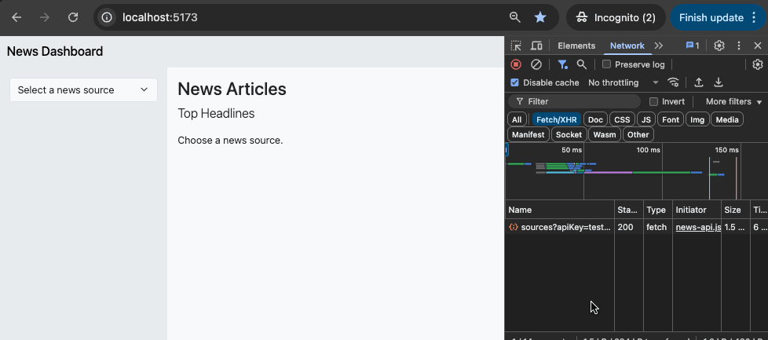
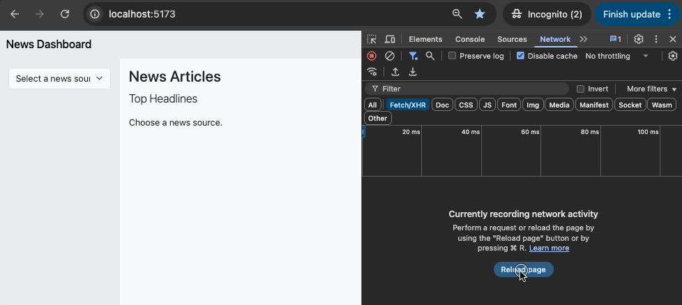

[](https://classroom.github.com/a/y1cvN0IY)

// Assignment 1 - Modular News Dashboard
// Author: Jean Amenyaglo

**Weight:** 20%
**Submission:** Via GitHub Classroom (starter files provided)

[Clone](#cloning-instructions) this repo to your computer and then follow the specs below to complete this assignment. When you are done, [submit](#submission-instructions) your solution. Also, be sure to put your name in the required parts of your assignment submission.

---

## Cloning Instructions

Follow these instructions to clone this repository to your computer.

1. Open **Visual Studio Code**.
1. Open the command palette and type `clone`. Select the `Git: Clone` option.
   - *Press either <kbd>F1</kbd> **or** <kbd>ctrl</kbd> + <kbd>shift</kbd> + <kbd>p</kbd> to open the command palette.*
1. Click `Clone from GitHub` and follow the prompts.
1. When a pop-up appears in VS Code to open the repository, open it in the current window.

## Submission Instructions

> *Note: Unless your instructor explicitly offers different submission instructions, you must follow the process outlined here.*

**All** your work for this assignment should be done on a ***local copy* of the assignment** on ***your* computer**.

To submit your work, follow the git *commit* and *push* process demonstrated by your instructor.

> **Do not upload** your assignment submission using GitHub's file-upload feature. Your instructor may assign a mark of zero (0%) for this assignment if you upload file(s) instead of using the git *commit* and *push* process.

## Overview
You will build a **Modular News Dashboard** composed of multiple custom **Web Components**.  
Each component will fetch, filter, or display news stories from **NewsAPI.org** or from a **local sample dataset** provided with the starter files.

Components must communicate through **custom events** and use **asynchronous JavaScript** (`async/await` or Promises) to manage data flow.

The assignment demonstrates your ability to combine:
- Core JavaScript logic and DOM updates  
- Web Component composition and encapsulation  
- Event-driven, reactive communication  
- Asynchronous programming and error handling  

## Learning Outcomes Assessed
1. Create and register custom **Web Components** using templates and Shadow DOM.  
2. Apply **composition** to build modular, reusable UIs.  
3. Define, dispatch, and handle **custom events** to enable decoupled interaction.  
4. Use **Promises or async/await** to retrieve and process data asynchronously.  
5. Employ best practices for code organization, readability, and error handling.

## What You'll Build
A small dashboard made up of **three or more custom components**. Each component should have a distinct purpose and communicate only through events.

### Required Components
**See each respective `/src/js/**.js` file for comments with tasks for you to complete.**

| Component | Description | Key Features |
|------------|--------------|--------------|
| `<news-dashboard>` | Root layout component | Composes child components; listens and relays events |
| `<news-source-picker>` | Lists available sources or categories | Fetches sources; dispatches `source:changed` |
| `<news-headlines>` | Displays headlines for articles | Fetches stories; listens for events; dispatches `articles:loaded` |
| *[OPTIONAL CHALLENGE]* `<news-search>` | Performs keyword search | Dispatches `search:requested` with query data |

## Data Source Options

### **Option A - Live API (NewsAPI.org)**
1. Create a free account at [https://newsapi.org](https://newsapi.org).  
2. Obtain your personal API key.  
3. Use the following endpoints (as needed):  
   - `GET /v2/top-headlines?sources={source}`  
   - `GET /v2/top-headlines/sources`  
   - `GET /v2/everything?q={query}` <-- used for optional search
4. Store the key in a local file (e.g., `config.js`) that exports a constant `API_KEY` and `API_URL`.  
5. **Do not commit your key** to GitHub (use `.gitignore`).
6. Run your app locally using the provided Vite setup (`npm start`).  
   **NOTE:** NewsAPI allows CORS requests from `localhost` only.
7. Handle API errors and empty responses gracefully.

### **Option B - Local Sample Data**
A `backend/sample-news.json` file is provided.  
Use it as a drop-in replacement for live data by running the provided backend system.  
The sample dataset mimics the NewsAPI response structure so that your code works identically in either mode.

>  **DO NOT ALTER THE SAMPLE DATASET**
> Your components should work seamlessly with both real and sample data sources.

To run the backend server, in a new terminal, install the backend dependencies and run the server:

```sh
cd backend
npm i
npm start
```

## Technical Requirements
1. **Composition**
  At least three custom components, each registered with `customElements.define()`.  
2. **Encapsulation**
  Each component uses a template and Shadow DOM for markup and styles.  
3. **Events**
  At least two custom events (`source:changed`, `articles:loaded`).  
4. **Async Data**
  Use `fetch()` with `async/await` or Promises; include error handling and loading states.  
5. **Interactivity**
  User actions (filter, search, refresh) must trigger reactive UI updates.  
6. **Code Quality**
  Readable, modular, commented JavaScript following best practices.  
7. **Visual Design**
  Clean, consistent styling within Shadow DOM (no CSS frameworks required).  

## Starter Files

You will receive a GitHub Classroom repository with the following:

- `src/`
  - `index.html`
  - `css/styles.css` – A basic stylesheet (use as needed)
  - `js/`
    - `config.js` - Placeholder for API key
    - `main.js` – JavaScript file where you will write your main app logic
    - `api/`
      - `news-api.js` - API functions
    - `components/`
      - `news-dashboard.js`
      - `news-source-picker.js`
      - `news-headlines.js`
  - `README.md` - This file (description and setup instructions)
- `backend/` - Location of the backend server for local development and testing
  - `sample-news.json` - Sample data to build and test the app
- `tests/` - Location of the included test suite

## Sample Application Run



## Sample Application Error



## Evaluation Criteria (20 Marks Total)

**NOTE: You must demonstrate incremental development of your solution. This means that you must begin work on your solution as soon as possible and commit often to the assignment repository. Each commit must demonstrate functional improvements to the solution. Failure to show incremental work during the assignment period will result in loss of marks of up to 20%.**
 
**Additionally, you are encouraged to use external resources to help you learn what is needed for the assignment. However, if you submit code that differs greatly from what was demonstrated in class it must be documented (e.g. comments, citations, etc.) and you may be asked to provide a verbal explanation of how the code works to your instructor. Failure to explain any code you submitted will be considered as potential evidence of academic misconduct and may trigger an investigation, potentially resulting in further consequences.**

| Category | Marks | Description |
|-----------|--------|----------|
| Functional Completeness | 6 | Meets composition, data handling, and event requirements |
| Component Implementation | 5 | Individual components are correctly implemented: async requirements, proper lifecycle calls, and state management |
| Asynchronous Programming | 3 | Required API functions are correctly implemented |
| UI & Encapsulation | 2 | Shadow DOM, templates, and clean presentation |
| Reflection | 4 | Clear update to README with complete answers to all three points |

> NOTE: see attached rubric on Brightspace for more details on criterion scoring.

## Testing and Feedback
- Run the provided test suite
  ```sh
  cd tests
  npm i
  npm run test:app
  ```
- The tests check for:
  - Component registration and composition  
  - Proper dispatch and handling of custom events  
  - Correct fetching and rendering of sample news data  
  - Error-state handling and reactive updates  
- Passing tests provide immediate feedback before submission

## Tips for Success

- Commit early and often with clear messages — incremental commits are required for full marks.
- Build and test primarily with the provided `backend/sample-news.json` (Option B). If you use the live API (Option A), verify locally as well, but the auto-grader runs against the sample dataset.
- Define and document your custom events (for example: `source:changed`, `articles:loaded`). Keep event names and payload shapes consistent and use events for decoupled component communication only.
- Use `async/await` with `try/catch` for all fetches and show visible loading and error states inside each component (spinners, friendly messages) instead of failing silently.
- Handle edge cases deliberately: empty results, no sources available, network errors, cancelled prompts, and missing/invalid API keys — render useful fallbacks and do not throw uncaught errors.
- Keep components small and focused: use templates + Shadow DOM for encapsulation, export small helper functions where sensible, and comment any non-obvious logic for clarity.
- Never commit API keys. If using Option A, store your key locally in `js/config.js` and add that file to `.gitignore`.

## Submission Instructions

1. Complete your solution in your GitHub Classroom repository.
2. Push commits regularly with clear messages during development to track progress.
3. Automated tests will run via GitHub Actions to evaluate your submission.

> **NOTE:** If you use Option A (Live API), add your key to `config.js` locally and **exclude** it from commits via `.gitignore`.

## Reflection Prompt (for README)
In your README.md (just below this description and list), include a short paragraph addressing:
- Are there any changes to the component structure you would recommend? Provide reasons.

I would consider splitting loading/error UI into a small reusable component. It keeps each main component focused and makes the dashboard easier to maintain as it grows.

- List and describe one advantage and one limitation of using custom events for component communication.

A key advantage is loose coupling — components communicate without depending on each other directly.
A limitation is that event flows can be harder to trace when many components are involved.

- How did you handle asynchronous errors in your code? Did you find it challenging? Did you learn anything?

I used try/catch in each component and displayed simple fallback messages. It wasn’t too difficult, but it reinforced how important clear loading and error states are when working with external APIs.


***ENTER YOUR RESPONSE TO THE REFLECTION PROMPT HERE***
